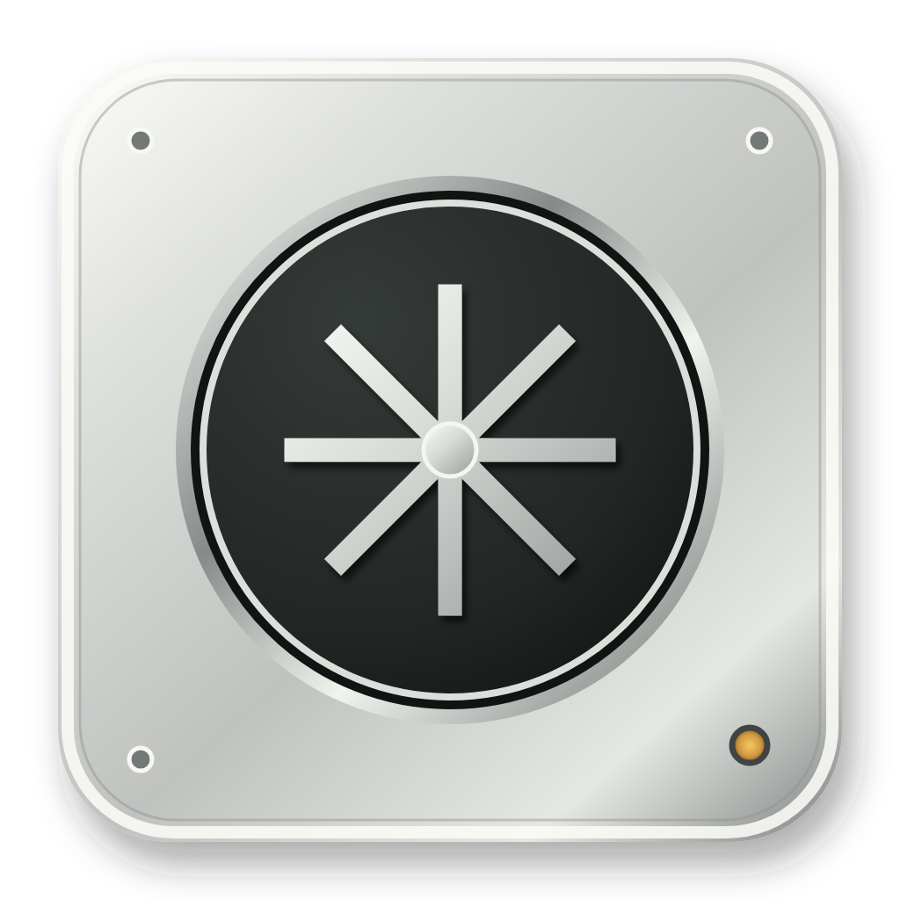
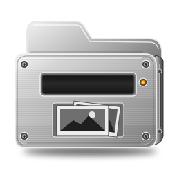
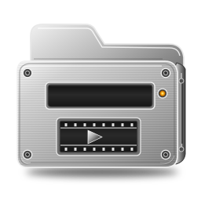
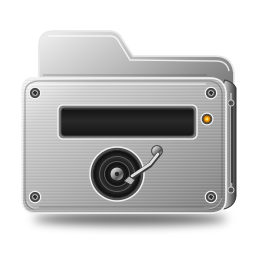
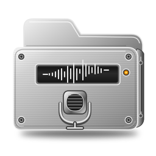
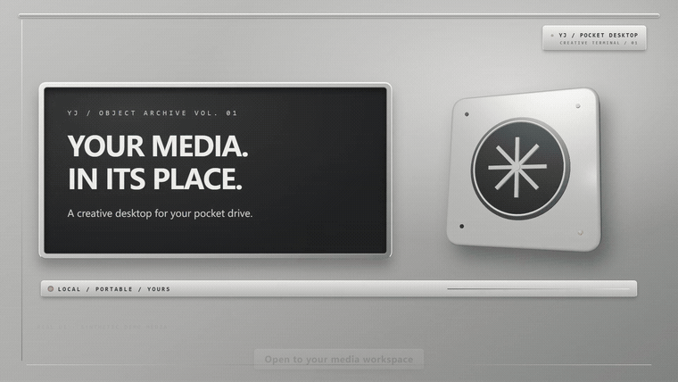

<h1 align="center">YJ-Pocket-Desktop</h1>

<strong>Your media, in its place.</strong> A local-first creative desktop for your pocket drive.

&nbsp; Photos &nbsp;&nbsp; &nbsp; Videos &nbsp;&nbsp; &nbsp; Music &nbsp;&nbsp; &nbsp; Recordings

<a href="README.zh.md">简体中文</a> · <a href="docs/media/yj-pocket-desktop-30s-en.mp4">Watch the 30-second film</a> · <a href="https://github.com/yangjingo/YJ-Pocket-Desktop/releases/tag/v1.2.3">Download Windows preview</a>

The preview loops silently. Click it for the full MP4 with music and captions. Demo media is synthetic; search shown in the film filters filenames in the current folder only.

YJ-Pocket-Desktop gives photos, videos, music, and recordings a calm, metallic workspace. Choose a media folder, browse and preview your files locally, and take the app with your drive. The vision is faster discovery and safer organization across drives; those capabilities are not yet in this preview.

## What works today

- Browse one selected media root, including folders and the `Pictures`, `Videos`, and `Music` categories. The recording archive defaults to `Recordings/IPhone-Voice`.
- Preview images and play browser-supported audio and video. With local `ffmpeg`, some incompatible videos can be converted to a playable copy while the original stays on disk.
- Filter filenames in the Finder’s **current folder**, switch between English and Chinese, and change the media root in Settings.
- Run the interface locally in a browser; a Windows portable package has also been built, pending launch validation.

The current version is `1.2.3`. A Windows portable package has been built and its contents verified, but an enterprise code-integrity policy on this machine prevented launch validation. macOS and Linux have not been tested on their respective systems. **Automatic multi-drive discovery, cross-drive indexed search, and in-app safe organization are planned, not shipped.** See the [product requirements and milestones](docs/specs/PRD.md).

## Your media stays yours

The app and your files live separately. `D:\YJ-Media` is the default library on the current development machine, not a required location; you can select another root in Settings. Personal media and indexes are not bundled with the app or the public source. Browsing and filename filtering run locally, and the local service binds only to `127.0.0.1`. Optional recording transcription calls an external service only when explicitly invoked.

The project takes inspiration from Everything’s responsiveness, but it neither integrates Everything nor claims equivalent cross-drive search or package size today. See the [index architecture](docs/specs/search-index-architecture.md) for the proposed approach and measurable targets.

## Get it or help build it

- Windows package: [v1.2.3 pre-release](https://github.com/yangjingo/YJ-Pocket-Desktop/releases/tag/v1.2.3). The unsigned build still needs launch testing on a Windows machine that allows it.
- To run from source, contribute, or build a package, follow the [development guide](docs/development.en.md).
- Explore the [documentation index (Chinese)](docs/README.md), [promo project](docs/media/promo/README.md), and [changelog](CHANGELOG.md).

## Run the unsigned Windows preview

1. Download `YJ-Pocket-Desktop-1.2.3-win-x64.exe` only from the [official v1.2.3 release](https://github.com/yangjingo/YJ-Pocket-Desktop/releases/tag/v1.2.3). Open PowerShell in the download folder and run `Get-FileHash .\YJ-Pocket-Desktop-1.2.3-win-x64.exe -Algorithm SHA256`. The result must be `65E23F8519DB997624C653BDDC3266AF342DB09F85F31FC45DC09763E7FBED85`. If it differs, do not run the file.
2. On a personal Windows device that permits unsigned apps, open the portable EXE. If Windows shows only the SmartScreen **“Windows protected your PC”** reputation warning, and you trust the source and have checked the hash, select **More info → Run anyway**. Then choose your own media folder in Settings; the download contains no personal media.
3. If **Run anyway** is unavailable, an administrator or Smart App Control blocks the app, or antivirus reports a threat, stop. Do not turn off Windows security features or change an organization’s policy to run this preview. Use a device where unsigned apps are permitted, or ask your administrator. This pre-release has not yet passed a real Windows launch test.

The code is [MIT-licensed](LICENSE). Personal media, secrets, caches, and `dist/` build output are excluded from the public repository.
