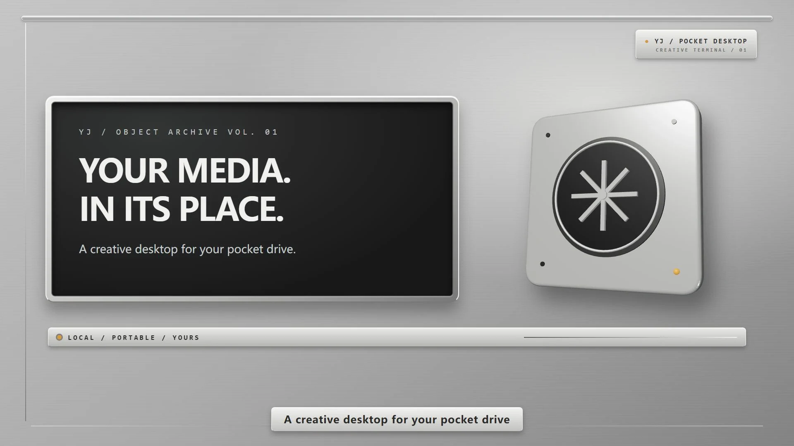

# YJ-Pocket-Desktop

[English](README.md) · 中文

把创意素材装进一座可以随身携带的桌面。YJ-Pocket-Desktop 是一款本地优先的素材浏览器：用银色金属的 3D 桌面，让照片、视频、音乐和录音各有自己的入口，最终希望让散落在不同硬盘上的作品也能被快速找到、安心整理。

[观看 30 秒英文演示（MP4）](docs/media/yj-pocket-desktop-30s-en.mp4) · 画面使用合成演示素材，不含个人媒体。镜头中的搜索仅演示当前文件夹的文件名筛选。

## 已经可以体验

- 在一个自选素材根目录中浏览文件夹，以及 `Pictures`、`Videos`、`Music` 等分类；录音档案默认位于 `Recordings/IPhone-Voice`。
- 预览图片，播放浏览器支持的音视频；不兼容视频可借助本机 `ffmpeg` 转换兼容副本，原文件仍留在磁盘上。
- 在 Finder **当前文件夹**按文件名筛选；切换中文或英文界面、修改素材路径。
- 在本机通过浏览器模式体验界面；Windows 便携包已构建，仍待启动验收。

当前版本为 `1.2.3`。Windows 便携包已构建并核对包内文件，但这台设备的企业代码完整性策略阻止了启动验收；macOS 和 Linux 也尚未实机验收。**自动发现多块磁盘、跨盘索引搜索和应用内安全整理仍在规划中，尚不是现有功能。** [产品需求与阶段边界](docs/specs/PRD.md)

## 素材属于你

应用代码与素材分开存放。当前这台电脑使用 `D:\YJ-Media` 作为默认素材目录；你可以在设置中选择另一个根目录。安装包和公开源码均不包含个人照片、录音或索引。浏览与筛选在本机进行，本地服务只监听 `127.0.0.1`；可选的录音转录会调用外部服务，需另外明确触发。

产品希望借鉴 Everything 的轻快体验，但当前没有集成 Everything，也没有宣称达到其跨盘检索能力或体积。技术方向与性能验收标准见[索引方案](docs/specs/search-index-architecture.md)。

## 获取与参与

- Windows 当前便携包：[v1.2.3 预发布](https://github.com/yangjingo/YJ-Pocket-Desktop/releases/tag/v1.2.3)。这是未签名包，需要在允许运行的 Windows 设备上继续启动验收。
- 想从源码启动、二次开发或自行打包：阅读[开发与构建指南](docs/development.md)。
- 想了解设计和路线：[文档导航](docs/README.md) · [宣传片工程](docs/media/promo/README.md) · [更新记录](CHANGELOG.md)。

## 运行未签名的 Windows 预览版

1. 仅从[官方 v1.2.3 Release](https://github.com/yangjingo/YJ-Pocket-Desktop/releases/tag/v1.2.3) 下载 `YJ-Pocket-Desktop-1.2.3-win-x64.exe`。在下载目录打开 PowerShell，运行 `Get-FileHash .\YJ-Pocket-Desktop-1.2.3-win-x64.exe -Algorithm SHA256`，结果必须是 `65E23F8519DB997624C653BDDC3266AF342DB09F85F31FC45DC09763E7FBED85`。若不一致，请勿运行。
2. 在允许运行未签名应用的个人 Windows 设备上打开便携 EXE。如果仅出现 SmartScreen 的“Windows 已保护你的电脑”信誉提示，且你已确认下载来源与哈希值，可以选择“更多信息 → 仍要运行”。启动后，在设置中选择自己的素材目录；下载包不包含个人素材。
3. 如果没有“仍要运行”、被管理员或 Smart App Control 阻止，或杀毒软件报告威胁，请停止操作。不要为运行预览版而关闭 Windows 安全功能或修改组织策略；请改用允许未签名应用的设备，或联系管理员。本预发布版尚未通过 Windows 实机启动验收。

代码采用 [MIT 许可证](LICENSE)。本地媒体、密钥、缓存和 `dist/` 构建产物不进入公开仓库。
